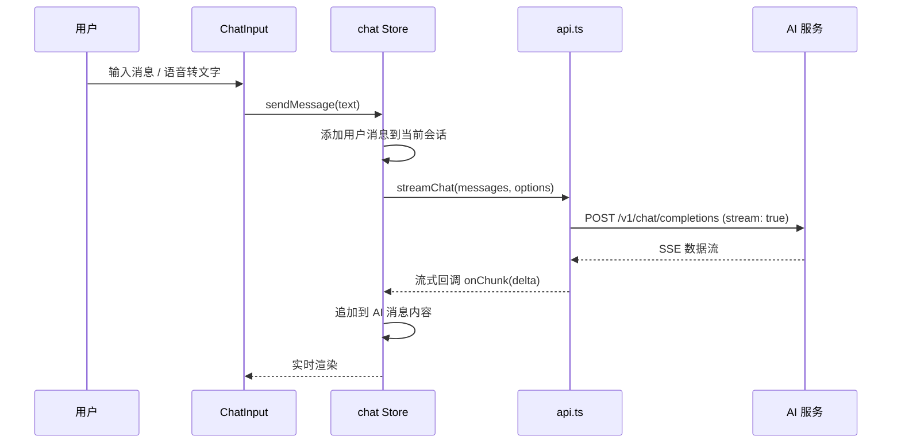
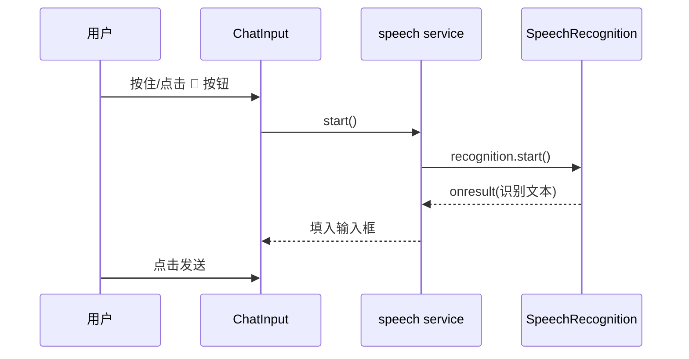

# 架构设计文档

> 本文为系统架构总览。配套文档:[项目结构](project-structure.md) · [AI 服务对接](ai-integration.md) · [语音功能](speech.md) · [数据持久化](data-persistence.md) · [文档总览](README.md)

## 总体架构

```
┌─────────────────────────────────────────────────────┐
│                    浏览器 (Vue 3 SPA)                │
│                                                     │
│  ┌──────────┐  ┌──────────┐  ┌───────────────────┐  │
│  │  View    │  │  Pinia   │  │  Web Speech API   │  │
│  │ 组件层    │→ │  Store   │→ │  (STT / TTS)      │  │
│  └──────────┘  └──────────┘  └───────────────────┘  │
│       │              │               │              │
│       │              ▼               │              │
│       │        ┌──────────┐          │              │
│       │        │ Service  │          │              │
│       │        │  api.ts  │          │              │
│       │        └──────────┘          │              │
│       │              │               │              │
└───────┼──────────────┼───────────────┼──────────────┘
        │              │               │
        │  fetch/SSE   │               │  浏览器原生语音
        ▼              ▼               ▼
┌──────────────┐  ┌────────────────┐  ┌──────────────┐
│  Vite Dev    │  │ OpenAI 兼容 API │  │ 系统语音引擎  │
│  Server      │→ │ (OpenAI/Deep-  │  │ (OS 级)      │
│  (代理)      │  │  Seek/Ollama)  │  └──────────────┘
└──────────────┘  └────────────────┘
```

## 数据流

### 文本对话流程



### 语音识别流程



## 状态管理设计 (Pinia)

### chat store

```ts
interface Conversation {
  id: string
  title: string
  messages: Message[]
  createdAt: number
}

interface Message {
  id: string
  role: 'user' | 'assistant' | 'system'
  content: string
  createdAt: number
  isStreaming?: boolean   // 是否正在流式输出
  error?: string          // 错误信息
}
```

### settings store

```ts
interface Settings {
  apiBaseUrl: string   // API 地址
  apiKey: string       // API Key
  model: string        // 模型名称
  systemPrompt: string // 系统提示词
  temperature: number  // 温度
  autoSpeak: boolean   // 自动朗读
}
```

## 服务层设计

### `services/api.ts`

- `streamChat()`:通过 fetch + ReadableStream 解析 SSE,支持流式输出
- 支持自定义 `onChunk` / `onDone` / `onError` 回调
- 完整消息历史传给 LLM

### `services/speech.ts`

- `createSpeechRecognizer()`:创建语音识别实例,封装 Web Speech API
- `speak(text)`:语音合成
- `isSpeechSupported()`:检测浏览器是否支持

## 关键设计决策

1. **流式输出**:使用 SSE 解析,让 AI 回复"打字机"效果实时显示
2. **本地持久化**:会话数据存 localStorage,刷新不丢失
3. **跨域处理**:设置页填 API 地址时直接请求;留空走 Vite 代理
4. **语音降级**:浏览器不支持 Web Speech API 时,隐藏语音按钮并提示
5. **TypeScript**:全链路类型安全,配置、消息、会话均有类型定义

## 浏览器兼容性

| 功能 | Chrome | Edge | Firefox | Safari |
|------|--------|------|---------|--------|
| Web Speech 识别 | ✅ | ✅ | ❌ | ✅ |
| Web Speech 合成 | ✅ | ✅ | ✅ | ✅ |
| SSE 流式 | ✅ | ✅ | ✅ | ✅ |

> Firefox 不支持语音识别,但支持语音合成。
